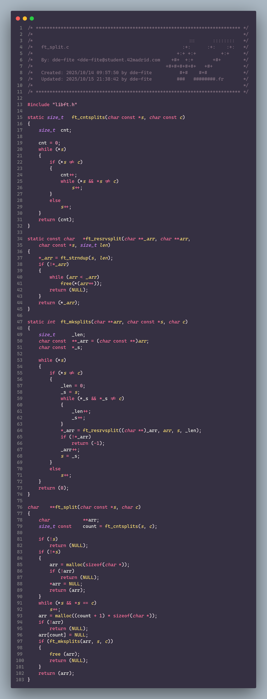
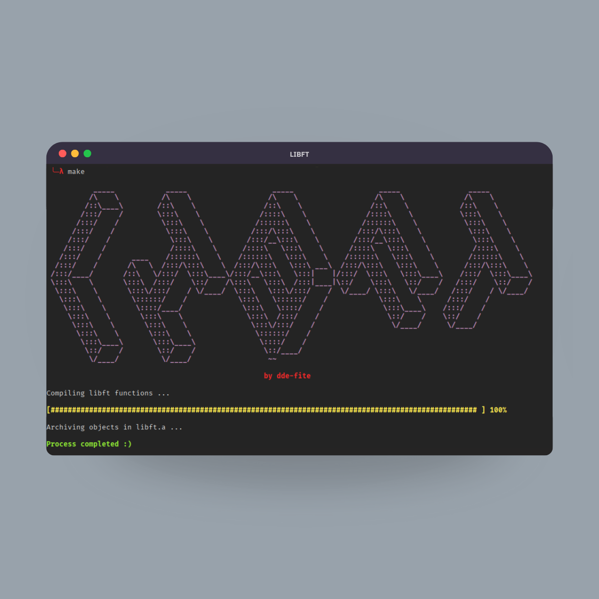

<p align="center">
	
	<h1 align="center">42_Libft</h1>
</p>

<p align="center">
	
	
    
</p>

<div align="center">
    <h2>My first project as a student at 42</h2>
    <p align="center">Since external libraries cannot be used in 42, except in specific cases, a library of basic functions must be created, recreating the standard C library, as well as other functions that are useful throughout the course, including those related to linked lists. You can also create your own functions of your choice.</p>
</div>

<div align="center">
	
	
</div>

## Functions
### Own Functions
<div align="center">
    <h3>ft_isspace</h3>
    <h3>ft_strndup</h3>
    <h3>ft_nbrlen</h3>
    <h3>ft_maxnbr/ft_minnbr</h3>
    <h3>ft_maxsize/ft_minsize</h3>
</div>

### Libc Functions
<div align="center">
    <h3>ft_strlen</h3>
    <h3>...</h3>
</div>

### Additional Functions
<div align="center">
    <h3>...</h3>
</div>

### Bonus Functions
<div align="center">
    <h3>ft_lstnew</h3>
    <h3>ft_lstadd_front</h3>
    <h3>ft_lstsize</h3>
    <h3>ft_lstlast</h3>
    <h3>ft_lstadd_back</h3>
    <h3>ft_lstdelone</h3>
    <h3>ft_lstclear</h3>
    <h3>ft_lstiter</h3>
    <h3>ft_lstmap</h3>
</div>

## Requirements
The functions and Makefile are designed for use in a UNIX-like environment; any use outside this scope does not guarantee correct or efficient operation.
- Make
- GCC

## Usage

### Compiling
- For the general section
``` bash
make
```

- For the bonus section.
``` bash
make bonus
```

### Using it as a static library
After installation is complete, the libft.a file will appear. This static library can be used in any project.

You can include the library by including libft.h and libft.a as in the example:

- First include the header file in your C or header files.
``` h
#include "libft.h"
```

- Then compile using the library
``` bash
gcc main.c libft.a
```

## Got any suggestions?
If you find any errors or have any new ideas for improving this repository, feel free to open an Issue or Pull Request, or contact me at my email address: nora@defitero.com

# License
This work is published under the terms of **[42 Unlicense](https://github.com/gcamerli/42unlicense)**.