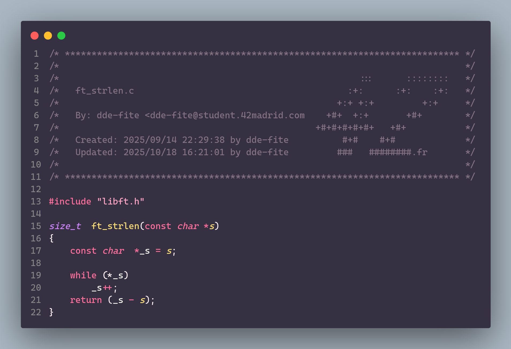

# ft_strlen

<h3 align="center">Measure the length of your strings</h3>

Strlen is a very easy function to create, but I decided to do it in an alternative way to make it more efficient for the processor.

I know that in practice there is hardly any difference between doing it this way and doing it in the more obvious way with indexes and a counter, and the compiler will optimize it so that at the assembly level it will probably be almost imperceptible, but I thought it was an interesting approach.

The idea is to declare a constant pointer called _s that will point to the content of s. Since it is a constant value, norminette allows me to declare and initialize at the same time, thus saving me a line ;) .

Then, while (\*_s), *or what would be the same (\*_s != '\0')*, will increment a memory position to _s. This will continue until the string ends.

If you're wondering how I can modify a constant pointer, it's because when you make a constant pointer, what it understands as constant is the value it points to, not the pointer itself.

	

