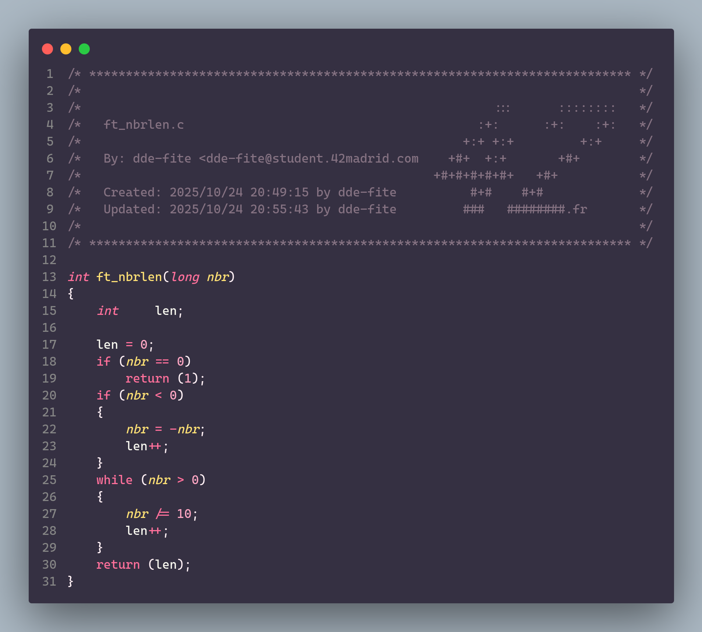

# ft_nbrlen

<h3 align="center">Measure the number of digits contained in an integer</h3>

Accepting a long int as a parameter, divide the number by 10 until it can no longer be divided. For each iteration, we will add a counter, which will be the return value.

If the number is negative, we will add 1 more to the counter.

The idea of accepting a long is to have more flexibility in case we need ranges wider than INT. In addition, this is a more convenient way to avoid INT_MIN overflows, which, as we know, can be quite problematic.

If you are wondering why I return int and not long or size_t, it is because the number of digits in long will always fit in an int. I also did not think it was correct to return a size_t, since the number of digits does not necessarily represent the size in bytes that it occupies.

	

